# Hi, I'm Luis 👋

I build agent workflows, automation products, and tools for focused work.

- YFN Academy Co-Lead at [@yfndev](https://github.com/yfndev)
- Public Relations & IT at [WaldorfSV](https://waldorfsv.de/)
- Based in Berlin, Germany

## Contribution activity

Counts include private contributions. Click any chart for the interactive drilldown.

## Project activity

  
  

## Toolbox

**Code:** TypeScript, Python, Swift, Kotlin, Shell  
**Products:** Next.js, React, Convex, Electron, macOS  
**Agent systems:** Codex, Claude Code, Playwright, Ralphex

## Connect

- [LinkedIn](https://www.linkedin.com/in/luiskisters/)
- [Email](mailto:luis.w.kisters@gmail.com)
